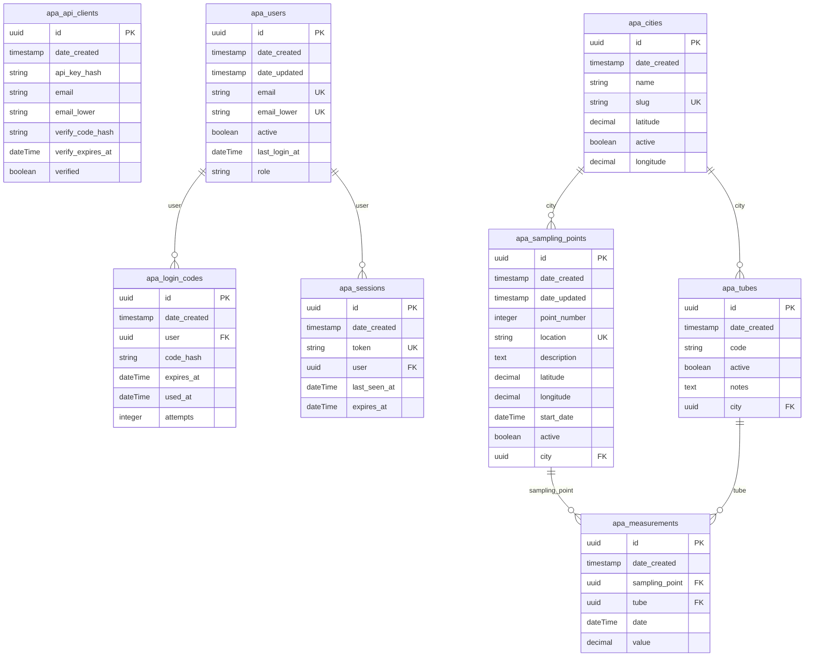

# APA Directus schema

Generated 2026-06-12T09:41:28.370Z from `https://fdnd-agency.directus.app` (Directus metadata API). Machine-readable version: [apa-schema.json](./apa-schema.json).

https://mermaid.ai/app/projects/6762e18a-98d8-4b0e-9d0e-8db914661361/diagrams/00689a57-898f-43cf-be53-f8ab50c3c873/version/v0.1/edit

## Entity-relationship diagram

## Collections

### apa_api_clients

| Field             | Type      | Null | Default | Key | References |
| ----------------- | --------- | ---- | ------- | --- | ---------- |
| id                | uuid      | no   |         | PK  |            |
| date_created      | timestamp | yes  |         |     |            |
| api_key_hash      | string    | yes  |         |     |            |
| email             | string    | no   |         |     |            |
| email_lower       | string    | no   |         |     |            |
| verify_code_hash  | string    | yes  |         |     |            |
| verify_expires_at | dateTime  | yes  |         |     |            |
| verified          | boolean   | no   | false   |     |            |

### apa_cities

| Field        | Type      | Null | Default | Key | References |
| ------------ | --------- | ---- | ------- | --- | ---------- |
| id           | uuid      | no   |         | PK  |            |
| date_created | timestamp | yes  |         |     |            |
| name         | string    | no   |         |     |            |
| slug         | string    | no   |         | UK  |            |
| latitude     | decimal   | no   |         |     |            |
| active       | boolean   | yes  | true    |     |            |
| longitude    | decimal   | yes  |         |     |            |

### apa_login_codes

| Field        | Type      | Null | Default | Key | References   |
| ------------ | --------- | ---- | ------- | --- | ------------ |
| id           | uuid      | no   |         | PK  |              |
| date_created | timestamp | yes  |         |     |              |
| user         | uuid      | no   |         | FK  | apa_users.id |
| code_hash    | string    | no   |         |     |              |
| expires_at   | dateTime  | no   |         |     |              |
| used_at      | dateTime  | yes  |         |     |              |
| attempts     | integer   | no   | 0       |     |              |

### apa_measurements

| Field          | Type      | Null | Default | Key | References             |
| -------------- | --------- | ---- | ------- | --- | ---------------------- |
| id             | uuid      | no   |         | PK  |                        |
| date_created   | timestamp | no   |         |     |                        |
| sampling_point | uuid      | no   |         | FK  | apa_sampling_points.id |
| tube           | uuid      | no   |         | FK  | apa_tubes.id           |
| date           | dateTime  | no   |         |     |                        |
| value          | decimal   | yes  |         |     |                        |

### apa_sampling_points

| Field        | Type      | Null | Default | Key | References    |
| ------------ | --------- | ---- | ------- | --- | ------------- |
| id           | uuid      | no   |         | PK  |               |
| date_created | timestamp | no   |         |     |               |
| date_updated | timestamp | yes  |         |     |               |
| point_number | integer   | no   |         |     |               |
| location     | string    | no   |         | UK  |               |
| description  | text      | no   |         |     |               |
| latitude     | decimal   | no   |         |     |               |
| longitude    | decimal   | no   |         |     |               |
| start_date   | dateTime  | no   |         |     |               |
| active       | boolean   | no   | true    |     |               |
| city         | uuid      | no   |         | FK  | apa_cities.id |

### apa_sessions

| Field        | Type      | Null | Default | Key | References   |
| ------------ | --------- | ---- | ------- | --- | ------------ |
| id           | uuid      | no   |         | PK  |              |
| date_created | timestamp | yes  |         |     |              |
| token        | string    | no   |         | UK  |              |
| user         | uuid      | no   |         | FK  | apa_users.id |
| last_seen_at | dateTime  | yes  |         |     |              |
| expires_at   | dateTime  | no   |         |     |              |

### apa_tubes

| Field        | Type      | Null | Default | Key | References    |
| ------------ | --------- | ---- | ------- | --- | ------------- |
| id           | uuid      | no   |         | PK  |               |
| date_created | timestamp | no   |         |     |               |
| code         | string    | no   |         |     |               |
| active       | boolean   | no   | true    |     |               |
| notes        | text      | yes  |         |     |               |
| city         | uuid      | no   |         | FK  | apa_cities.id |

### apa_users

| Field         | Type      | Null | Default | Key | References |
| ------------- | --------- | ---- | ------- | --- | ---------- |
| id            | uuid      | no   |         | PK  |            |
| date_created  | timestamp | yes  |         |     |            |
| date_updated  | timestamp | yes  |         |     |            |
| email         | string    | no   |         | UK  |            |
| email_lower   | string    | no   |         | UK  |            |
| active        | boolean   | no   |         |     |            |
| last_login_at | dateTime  | yes  |         |     |            |
| role          | string    | no   |         |     |            |
